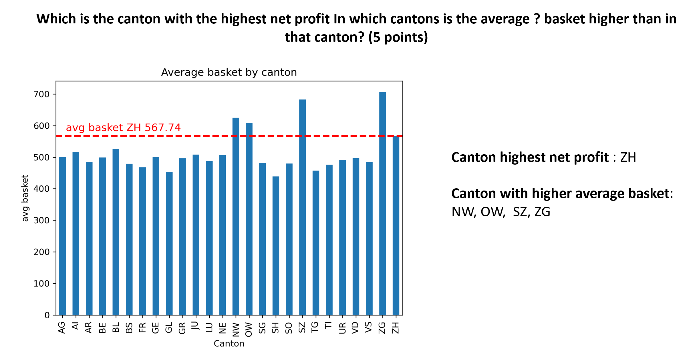

# Argusa-Challenge-Engineering-and-Analytics-2024
## The challenge
As Data Consultants for Argifts, a large online retailer, we were tasked with helping the CEO evaluate the company’s performance. Given a dataset, we had 3½ hours to explore, analyze, and present actionable insights. We had full flexibility to choose tools, transform data, and build visualizations to answer the CEO’s key business questions.

## The results
Using Python for data cleaning, manipulation, and analysis, we developed a series of compelling insights. The final deliverable was a slide deck designed for executive presentation, highlighting trends, opportunities, and recommendations.  

